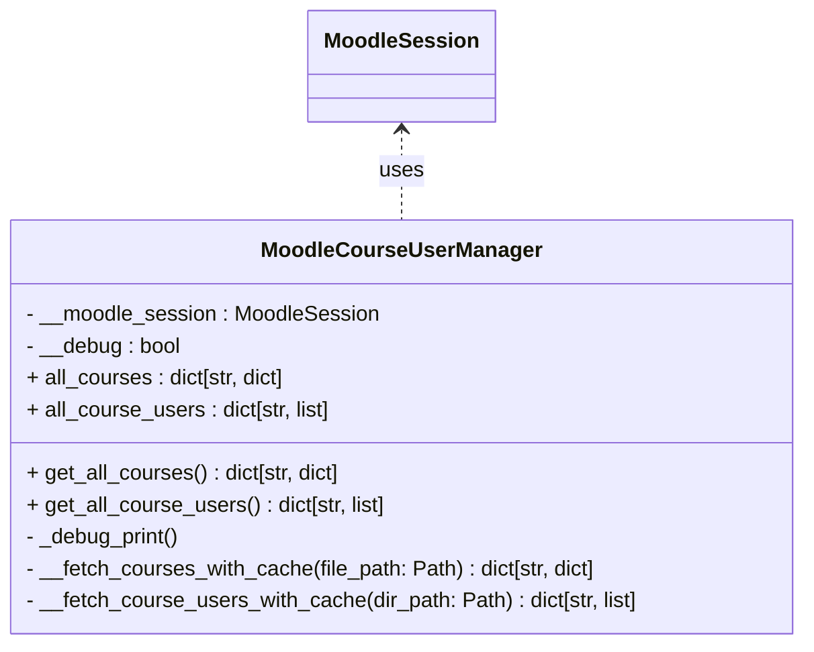
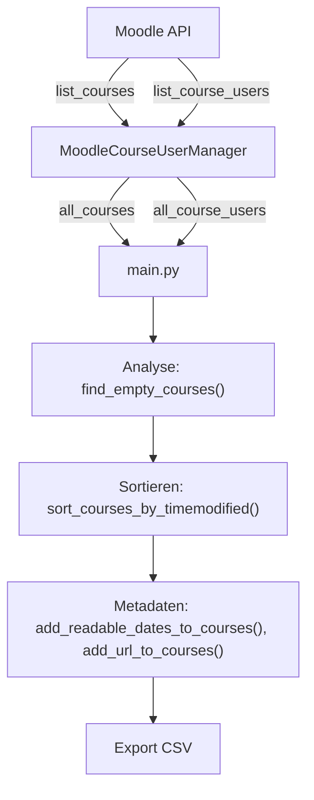
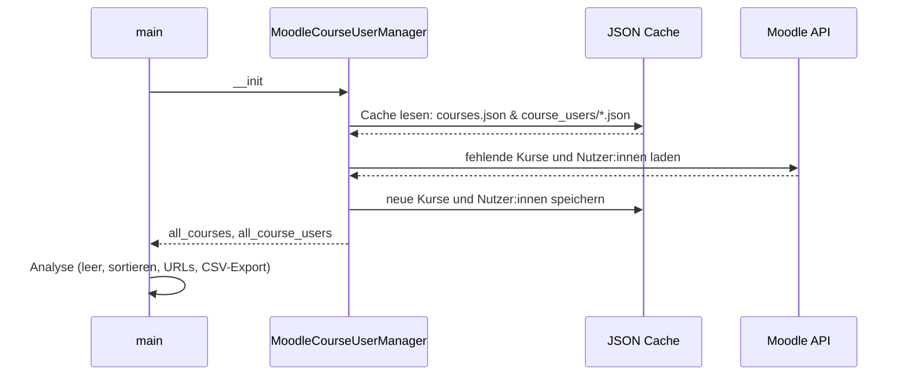

# Moodle Course User Manager (Proof of Concept)

Dieses Projekt ist ein **Proof of Concept** zur Analyse von Moodle-Kursen und eingeschriebenen Nutzer:innen. <br>
Es lädt Kursdaten und Nutzer:innen entweder aus einem lokalen Cache (JSON-Dateien) oder direkt über die Moodle-WebService-API. <br>
:warning: **HINWEIS:** Der lokale Cache dient nur Entwicklungs- und Testzwecken und ist langfristig **nicht gewollt**.

## Projektüberblick
Dieses PoC ermöglicht:
- Abruf aller Moodle-Kurse (per API und lokalem Cache).
- Abruf aller Nutzer:innen pro Kurs.
- Analyse leerer Kurse (ohne Nutzer:innen).
- Sortierung nach Änderungsdatum.
- Export von Kursinformationen als CSV.

## Installation & Vorraussetzungen

```bash
git clone https://git.ide3.de/moritzwaschkewitz/moodlecourseusermanager.git
cd moodlecourseusermanager

pip install python-moodle
```

>[!important]
>Benötigt wird eine funktionierende MoodleSession (via `py_moodle`): [siehe python-moodle-GitHub](https://github.com/erseco/python-moodle?tab=readme-ov-file#configure-your-environment)

## MoodleCourseUserManager-Klasse

### Attribute
- `self.all_courses: dict[str, dict]` <br>
Übersicht aller Kurse (Key: Kurs-ID, Value: Kurs-Details)
- `self.all_course_users: dict[str, list]` <br>
Übersicht aller Nutzinnen pro Kurs (Key: Kurs-ID, Value: Liste von User-Objekten)

### Methoden
- `get_all_courses() -> dict[str, dict]` / `get_all_course_users() -> dict[str, list]` - Getter für Attribute
- `_save_json(file_path, data)` / `_load_json(file_path)` - Hilfsmethoden für Caching
- `_debug_print(self, *args, **kwargs)` - Logging (nur print(...), ohne logging-Bibliothek)

Hilfmethoden des Konstruktors um Attribute zu laden:
- `__fetch_courses_with_cache(file_path) -> dict[str, dict]` - Lädt Kurse aus Cache oder Moodle
- `__fetch_course_users_with_cache(directory_path) -> dict[str, list]` - Lädt Nutzer:innen aus Cache oder Moodle

### Caching Hinweise
>[!note]
> Während der Entwicklung werden Daten **lokal in JSON-Dateien gespeichert.**
> Produktivbetrieb sollte direkt über die Moodle-API laufen und **nicht benötigte Daten direkt verwerfen.**

## Main-Skript (main.py)

### Helferfunktionen
- `find_empty_courses(course_users, all_courses)` - leere Kurse finden.
- `sort_courses_by_timemodified(courses)` - sortiert Kurse nach Änderungsdatum.
- `add_readable_dates_to_courses(courses)` - fügt lesbare Zeitstempel hinzu (`%Y-%m-%d %H:%M:%S`).
- `add_url_to_courses(courses, base_url)` - ergänzt Moodle-URLs.
- `export_courses_to_csv(courses, file_path, fieldnames)` - CSV-Export
- `collect_categoryids(courses)` - TODO: bestimmte Kursbereiche ausschließen

### Beispiel-Ablauf
1. Kursdaten und Nutzer:innen laden (`MoodleCourseUserManager`-Konstruktor)
2. Leere Kurse identifizieren
3. Sortieren und anreichern (Datum, URL)
4. Export nach CSV

### Export
Leere Kurse werden nach CSV exportiert mit Spalten: <br>
`id, fullname, shortname, startdate, startdate_human, timecreated, timecreated_human, timemodified, timemodified_human, url`

## Beispiel Datenstrukturen
### Kurse
```json
{
  "42": {
    "id": 42,
    "shortname": "XY",
    "categoryid": 123,
    "categorysortorder": 1234567,
    "fullname": "Modul XY",
    "displayname": "Modul XY",
    "idnumber": "",
    "summary": "",
    "summaryformat": 1,
    "format": "topics",
    "showgrades": 1,
    "newsitems": 3,
    "startdate": 1735729200,
    "enddate": 0,
    "numsections": 10,
    "maxbytes": 262144000,
    "showreports": 0,
    "visible": 1,
    "hiddensections": 0,
    "groupmode": 0,
    "groupmodeforce": 0,
    "defaultgroupingid": 0,
    "timecreated": 1735729200,
    "timemodified": 1735729200,
    "enablecompletion": 0,
    "completionnotify": 0,
    "lang": "",
    "forcetheme": "",
    "courseformatoptions": [
      {
        "name": "hiddensections",
        "value": 0
      },
      {
        "name": "coursedisplay",
        "value": 0
      }
    ],
    "showactivitydates": false,
    "showcompletionconditions": null
  }
}
```

### Kursnutzer:innen
```json
{
  "42": [
      {
        "id": 1234,
        "username": "mowas002",
        "firstname": "Moritz",
        "lastname": "Waschkewitz",
        "fullname": "Moritz Waschkewitz",
        "email": "moritz.waschkewitz@stud.hn.de",
        "department": "",
        "firstaccess": 1735729200,
        "lastaccess": 1735729200,
        "lastcourseaccess": 1735729200,
        "profileimageurlsmall": "https://moodle.hsnr.de/theme/image.php/boost_union/core/1755177765/u/f2",
        "profileimageurl": "https://moodle.hsnr.de/theme/image.php/boost_union/core/1755177765/u/f1",
        "roles": [
          {
            "roleid": 11,
            "name": "LAssistenz",
            "shortname": "lehrpersonassistenz",
            "sortorder": 0
          }
        ],
        "enrolledcourses": [
          {
            "id": 42,
            "fullname": "Modul XY",
            "shortname": "XY"
          },
          {
            "id": 43,
            "fullname": "Modul XY- Tutorium",
            "shortname": "XY-TUT"
          }
        ]
      },
      {
        "id": 5678,
        "username": "mustu001",
        "firstname": "Muster",
        "lastname": "Student",
        "fullname": "Muster Student",
        "email": "muster.student@stud.hn.de",
        "department": "",
        "firstaccess": 1735729200,
        "lastaccess": 1735729200,
        "lastcourseaccess": 1735729200,
        "profileimageurlsmall": "https://moodle.hsnr.de/theme/image.php/boost_union/core/1755177765/u/f2",
        "profileimageurl": "https://moodle.hsnr.de/theme/image.php/boost_union/core/1755177765/u/f1",
        "roles": [
          {
            "roleid": 16,
            "name": "Studierende",
            "shortname": "student",
            "sortorder": 0
          }
        ],
        "enrolledcourses": [
          {
            "id": 42,
            "fullname": "Modul XY",
            "shortname": "XY"
          },
          {
            "id": 44,
            "fullname": "Modul ABC",
            "shortname": "ABC"
          }
        ]
      }
  ]
}
```

### CSV-Export
```csv
id,fullname,shortname,startdate,startdate_human,timecreated,timecreated_human,timemodified,timemodified_human,url
45,Modul DEF,DEF,1735729200,2025-01-01 12:00:00,1735729200,2025-01-01 12:00:00,1713250000,2025-01-01 12:00:00,https://moodle.hsnr.de/course/view.php?id=45
```

## Diagramme
## Klassendiagramm


### Datenflussdiagramm


### Programmfluss
